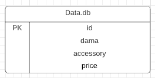

# Kendama-Order-History

## Contents
* [Introduction](#introduction) 
  * [Objective](#objective)
  * [Proposal](#proposal)
* [Architecture](#architecture)
  * [Risk Assessment](#risk-assessment)
  * [Kanban Board](#kanban-board)
  * [Test Analysis](#analysis-of-testing)
* [Infrastructure](#infrastructure)
  * [Jenkins](#jenkins)
  * [Entity Diagram](#entity-diagram)
  * [Interactions Diagram](#interactions-diagram)
  * [The 4 Services](#the-4-services)
* [Development](#development)
  * [Front-End Design](#front-end)
  * [Unit Testing](#unit-testing)
* [Footer](#footer)
  * [Future Improvements](#future-improvements)
  * [Author](#author)
  * [Acknowledgements](#acknowledgements)
  * [Versions](#versions)


## Introduction

### Objective

The objective for this project is as follows:
> To create a service-orientated architecture for your application, this application must be composed of at least 4 services that work together.

The other constraint in this project is the technologies that need to be used.
The project needs to utilise the technologies discussed during the training modules:
* Kanban Board: Asana or an equivalent Kanban Board
* Version Control: Git - using the feature-branch model
* CI Server: Jenkins
* Configuration Management: Ansible
* Cloud server: GCP virtual machines
* Containerisation: Docker
* Orchestration Tool: Docker Swarm
* Reverse Proxy: NGINX
* Database Layer: MySQL

### Proposal

At the start of the project, I realised that to meet all the requirements and to ensure the MVP was produced in the time frame provided, I focused on the infrastructure and implementation of my CI/CD pipeline. Therefore the application itself is less important with only the essential features developed.

#### Kendama Ordering
* Service-1 (front-end): Displays the results of the following 3 services for the user to see, as well as a brief history of past results.
* Service-2: Returns a random Kendama from a predefined list.
* Service-3: Returns a random accessory from a predefined list.
* Service-4: Returns the total price from both Kendama and accessory and add £3.50 for shipping.

## Architecture

### Risk Assessment

My detailed risk assessment can be seen below, outlining the minor and major risks that have potential to impact the success of this project. Creating a risk assessment is important in any project as it helps make the project more robust and provides methods of mitigating the impact of any such risk that does occur.


View the original document [here](https://docs.google.com/spreadsheets/d/166MTAAl1HzXAQWaA2iS9Mz9MXRZpsr7y-s-MHqZk_yk/edit?usp=sharing)

### Kanban Board

For project tracking i decided to use [Trello](https://trello.com) over other similar services as Trello is super lightweight and has a visusal representation that is easy to understand and follow.


View the updated board [here](https://trello.com/b/xKZvWDN1/qa-project-2-user-story)

### Analysis of Testing

Testing is essential to any project of any scale. With such a small scale project such as this that adopts a CI?CD approach, it is important to plan testing areas and implement a system to run automated tests. Below is the scope of testing for this project:


This report is based on the [MoSCoW](https://en.wikipedia.org/wiki/MoSCoW_method) scale. With this report it is obvious that Unit Testing is the only form of testing that is essential and integration testing is marked as 'Should do' and will be implemented if the time scale allows it.

## Infrastructure

In this project I have implemented a Continous Deployment structure so that new versions of the application can be deployed quickly, smoothly and with limited down-time.

### Jenkins 

I have implemented a web-hook for branch `main`, which means whenever new content is pushed to `main` GitHub will tell Jenkins to run the following pipeline: 

#### **1.** Test: pytest  
> Unit tests are run as outlined [earlier](#analysis-of-testing). A coverage report is produced and can be viewed in the console logs. 

#### **2.** & **3.** Build & Push: docker-compose  
> Jenkins' credentials system is used to handle logging into DockerHub, and the new images are then pushed to the repository specified.

#### **4.** Configure: ansible 
> Ansible configures several things:
> * Installing dependencies (such as docker and docker-compose),
> * Setting up the swarm, and joining the swarm on all worker nodes,
> * Reloading NGINX with any changes to the nginx.conf file.

#### **5.** Deploy: docker swarm/stack 
> Jenkins copies the `docker-compose.yaml` file over to the manager node, SSH's onto it, and then runs `docker stack deploy`.

*The commands used in Jenkins' pipeline can be seen in the [Jenkinsfile](./Jenkinsfile)*

#### Pipeline Diagram
Below is a diagram of the CI pipeline implemented:


At the start of the project i created a CI pipeline diagram that was outdated when new tools were required in the implementation of the pipeline:


### Entity Diagram

This project only uses one table in the database however it is still important to detail the structure of the table. Below is a diagram for the table used in this project.
<br/>



At the start of the project, my initial idea for the application was to create a service that randomly produced an unique USERNAME. Below is an ERD diagram for that idea.
<br/>


### Interactions Diagram
Below is a diagram which maps out where information is taken from when the user connects to the NGINX machine on port 80.


Using Docker Swarm as an orchestration tool, I created a virtual machine network which can all be accessed by a user. As the diagram shows, this network has a NGINX load-balancer which diverts the user to a VM that has the least connections, this extra layer increases security as it makes the user one step further from the main application.

### The 4 Services
As also described previously, the below diagram represents how the services interact with one another.


How this system works is the front-end sends GET requests to API-1 and API-2. It then sends their responses to API-3 as a POST request, and API-3 sends its data back in response. Lastly the front-end can send requests to the MySQL instance to INSERT the new entry, and SELECT the old entries in order to display a history to the user as required.

## Development

### Front End

When a user navigates to port 80 on the NGINX's IP, the relavant information will be displayed in the format shown below:


### Unit Testing

Unit testing is used here to test each services' route functions with various scenarios. These tests are run automatically with every unique Git push using the Jenkins pipeline that has a [script](./scripts/test.sh) dedicated just to testing. Once this script is completed Jenkins will display a report that shows if the testing was successful and provides a report that shows the percentage of the application tested.


This coverage report shows that every line in each of my routes has been tested at least once.

The exact lines used in Jenkinsfile are:

```
#Install dependencies
sudo apt-get update > /dev/null
sudo apt-get install python3 python3-venv libpq-dev -y > /dev/null

#Install pip requirements
python3 -m venv venv && source venv/bin/activate
pip3 install --upgrade pip
pip3 install --upgrade setuptools
for i in {1..4}; do 
pip3 install -r service_${i}/requirements.txt > /dev/null; 
done 

#Unit testing
python3 -m pytest --disable-warnings --cov --cov-config=.coveragerc --cov-report=term-missing
```

This installs the packages required to run testing in all four service's requirements.txt files, and then runs the tests. 

During implementation of my unit tests I came across a report that had reduced coverage:


The fix for this was to create a `.coveragerc` file that tells pytest exactly which files and lines to include or ignore. For example my .coverarc file has `omit=venv/` and `exclude_lines = if __name__=='__main__':` this way my virtual environment packages are not shown in the report. The exclude lines section tells the unit tests to ignore the app.run lines as they will not be executed during testing.

## Footer

### Future Improvements

* To decrease total time of build, push and deploy, I would user Nexus as a Private Image Repository.
* Implement Integration testing using Selenium.
* Implement a dictionary of photo links to add a more visual representation of each order.
* Apply a healthy ammount of CSS styling to make the front-end more pleasing to look at.
* During the implementation of a rolling update i came across this error in Jenkins:

<br>
I found that logging into the Jenkins VM and running the command `sudo docker system prune --all --force` fixed this issue.

### Author
	
Marius Saunders
	
### Acknowledgements

<a href="https://github.com/OliverNichols">Oliver Nichols</a>

### Versions
13/08/21 - v1.0.0